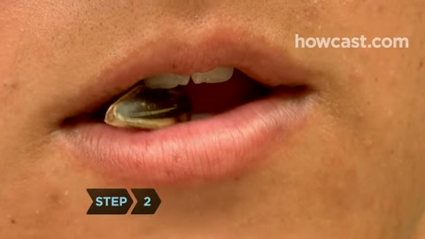
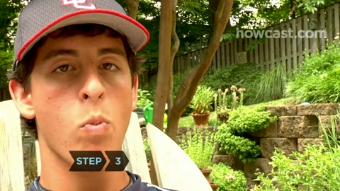
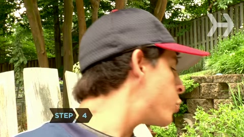
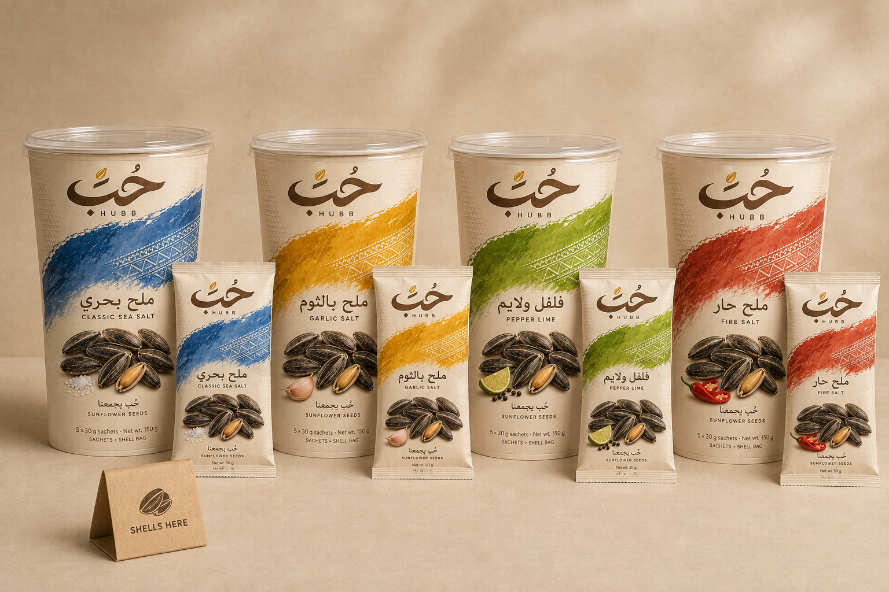
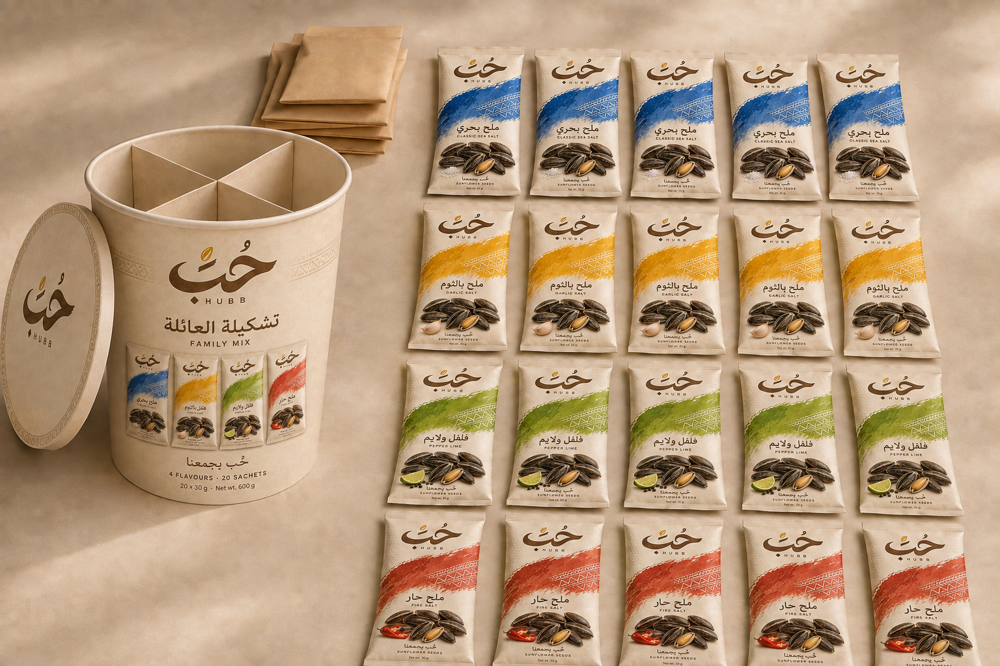
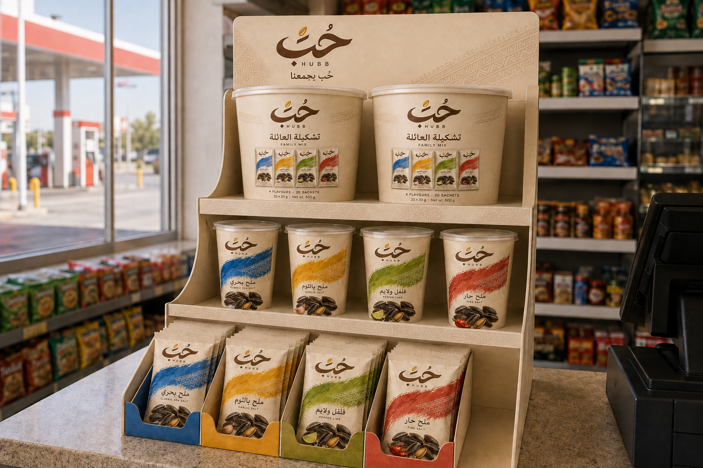

# HUBB: eating and packaging

[Visual guide](https://roshanmahamoodnk.github.io/hubb-companion/video_review/) · [Short LLM reference](HUBB_RULES.md) · [Structured data](reference.json)

**Crack the husk. Eat only the kernel.**

| 1. Place | 2. Crack | 3. Separate | 4. Spit |
|---|---|---|---|
|  |  |  |  |
| Put one seed between the teeth. | Crack with a small bite. | Tongue and teeth separate kernel and husk inside. | Bring husk to lips and spit it out. Keep and eat the kernel. |

Internal separation is narration-supported, not visible. Tiny ejected fragments are unresolved.

**Edited sequence · 9 seconds**

**Spit · half speed**

Finger removal is an **alternative** to spitting. Collect discarded husks in the shell bag; never return them to food. Shell-bag collection is HUBB guidance, not shown in this tutorial.

## Every package

| Format | Contents | Use / channel |
|---|---|---|
| Single sachet | 30 g | Open to snack; baqala / supermarket. |
| Retail case | 24 × 30 g = 720 g | Sell sachets singly; traditional / modern retail. |
| Travel cup | 5 × 30 g = 150 g | Open lid, take one sachet; supermarket / petrol station / travel. |
| Family mix | 20 × 30 g = 600 g | Four flavours, five each; share sachets; ecommerce / key accounts. |
| Shell bag | Discarded husks only | Keep waste separate from food. |

Flavours: **Classic Sea Salt · Garlic Salt · Pepper Lime · Fire Salt.** Preserve supplied artwork exactly. The 24-sachet case is planned; the display image does not verify a 24-unit carton. Same-flavour retail case assumed.

## For an LLM

Start with [HUBB_RULES.md](https://raw.githubusercontent.com/Roshanmahamoodnk/hubb-companion/main/video_review/HUBB_RULES.md). Use the linked images or motion files when the model supports them. Text-only models can read the rules; a URL does not guarantee video understanding or permanent memory.

Source: [Howcast demonstration](https://www.youtube.com/watch?v=X0nOwz5KMjc). Short motion excerpts are for reference and analysis; no commercial reuse licence is granted here. [Timestamps and file hashes](quick-assets/provenance.json). Package images are supplied design references.
